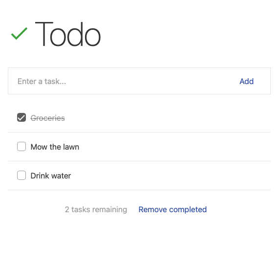

# Typescene sample application: Todo

This repository contains an example application for the Typescene framework. It contains the following components:

- Application instance (using `@typescene/webapp`)
- `TodoService` -- Service that provides an API for creating and managing `TodoItem` objects
- `MainActivity` -- Single activity for the application
- Main view (using JSX)
- `TodoStatusLine` -- Example of a simple view component

This application uses Webpack for bundling, and for running a development server.

<p align="center"></p>

### Build & Run

To build this project (all output files will be stored in a `dist` folder), run the following command:

```bash
npm run build
```

To run this project in development mode (using Webpack HMR, i.e. Hot Module Replacement), run the following command:

```bash
npm run start
```

### License

This code is covered by an MIT license.
